Windows Sidebar for Rainmeter
Free and Open Source, works on Windows 7, 10 and 11
=======================
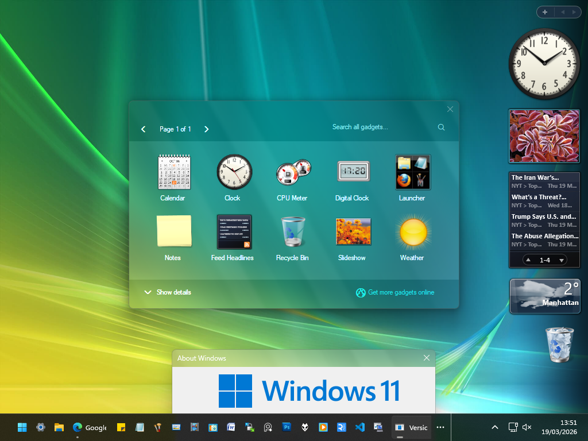

---------------
Been in the works for a couple of years but I've been putting it off...
Now I had some motivation and help to finish it, however!

This is a massive update to the Vista Rainbar, originally by legace/Gavatx, later updated by me and then later by poiru, and now by me again
A modernized, yet nostalgic Vista Sidebar with lots of great features and skins...

__It also uses like 40MB of RAM and 0-1% CPU on my Core i5 Laptop, can't say the same about most Sidebars.__

# HOW TO INSTALL?

1. Download https://www.rainmeter.net/
2. Install Rainmeter 
3. Download Windows-Sidebar.rmskin from Releases and double click it

Enjoy 

# FEATURES IN 5.0:

## Gadgets
You'll find almost every Gadget you may want:

Preview|Name|Features|Alternatives|Settings
|-|-|-|-|-|
|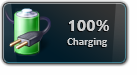|Battery|Displays current battery level and status|Yes|No|No
|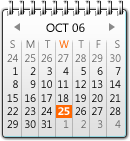|Calendar|Shows current date, month view, and upcoming days|Yes|Yes|Yes
|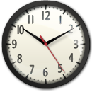|Clock|Displays current local time with configurable styles|No|No|Yes
|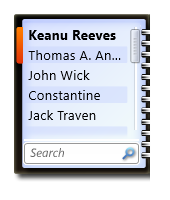|Contacts|Shows contact list with quick interaction options|No|No|Yes
||CPU Meter|Monitors CPU load and performance in real time|No|No|No
|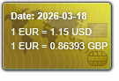|Currency|Displays up-to-date currency exchange rates|No|No|Yes
|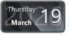|Date|Shows the current date with customizable format|No|No|No
||Digital Clock|Displays digital time with day/night theme options|No|No|Yes
|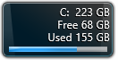|Drive|Monitors disk usage and available space|No|No|Yes
||Feed Headlines|Displays live RSS or news feed updates|No|Yes|Yes
|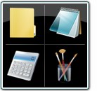|Launcher|Customizable shortcut panel for launching apps or websites|No|No|Yes
||Media Player|Controls playback for supported media players|Yes|No|Yes
|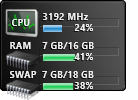|Multi-Meter|Combines CPU, RAM, and disk usage monitoring in one|No|No|No
|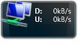|Network|Displays network IP, upload/download speeds|No|No|No
|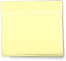|Notes|Simple sticky notes gadget for quick text memos|No|No|Yes
||Picture Puzzle|Interactive sliding puzzle game using selected images|No|No|Yes
||Recycle Bin|Shows Recycle Bin status and allows quick cleanup|No|No|Yes
||Red Button|Customizable button for system actions or shortcuts|No|No|Yes
||RED Clock|Stylish clock with alarm and customizable appearance|No|No|No
|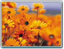|Slideshow|Displays photos from a selected folder as a slideshow|Yes|No|Yes
|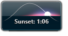|Sunset|Shows sunrise/sunset times and weather info|No|No|Yes
|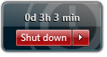|Uptime|Displays system uptime since last boot|No|No|No
|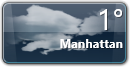|Weather|Shows current weather conditions and forecast|No|No|Yes
|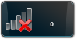|Wireless|Displays Wi-Fi signal strength and connection info|No|No|No
||World Clock|Displays current time for multiple locations|No|No|Yes

----

## Skins / Styles
Included Skins from the Classics:

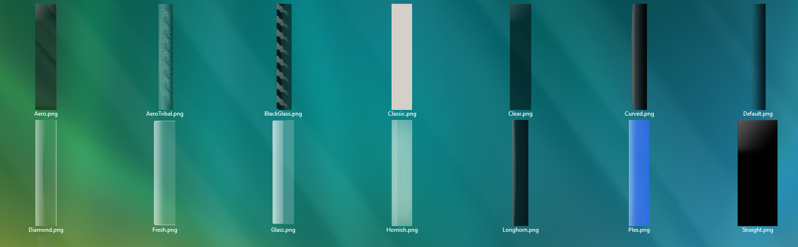

The Sidebar is also colorizable through the Settings Window.
There is a Windows 7 option, where the sidebar is invisible and just a small + icon in the corner :)

## Galleries
There are 4 Gallery Styles respective to Vista RTM, Vista Beta 2 5384, Vista Beta 2 5219, Vista Beta 2 5212

----

## Settings

Sidebar and Gadgets have dedicated Config tools

 

## Capabilities
- Ability to position on the Right or on the Left with one click
- Option to stay on top of other Windows (Reserve screen space)
- Easy Snapping
- Blur Effect on Win10 / Win11
- Super easy Customization
- Lots of Variants in every Gadget
- Possible future Translations
- Create your own Gadgets using included Gadgets\Template

## Extras
Some more included Extras for real Windows fans:

Preview|Name|Features
|-|-|-|
||**Reserve Screen Space**|Included Utility lets you realistically reserve screen space for the Sidebar, does not run in Memory
||**Build Tag**|Put a configurable Build tag on your Desktop
||**Configuration**|The sidebar has lots of configuration options

## Vista Beta 2 Gadgets
For historical integrity, there are also Vista Beta 2 Gadgets in the Project
They can be enabled either through a Sidebar Theme or by enabling "Show All Gadgets"

Preview|Name|Features|Alternatives|Settings
|-|-|-|-|-|
|Vista Beta 2 Build 5384 Gadgets|-|-|-|-
|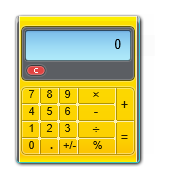|Calculator|You can do math on it|No|No|Yes
|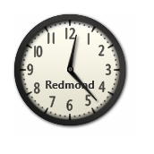|Clock|Displays current local time with configurable styles|No|No|Yes
||CPU Meter|Monitors CPU load and performance in real time|No|No|No
||Currency|Displays up-to-date currency exchange rates|No|No|Yes
||Feed Viewer|Displays live RSS or news feed updates|No|Yes|Yes
||Feed Watcher|Displays live RSS or news feed updates|No|Yes|Yes
||Number Puzzle|Interactive sliding puzzle game using selected images|No|No|No
||Picture Puzzle|Interactive sliding puzzle game using selected images|No|No|No
||Recycle Bin|Shows Recycle Bin status and allows quick cleanup|No|No|Yes
|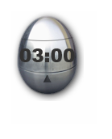|Timer|Kitchen Timer for just about anything|No|No|Yes
|Build 5219|-|-|-|
||Analog Clock|Displays current local time with configurable styles|No|No|Yes
|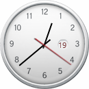|Clock|Displays current local time, day and night mode|No|No|Yes
||Mail|Shows a fake number, currently not possible to make it real|No|No|Yes
||Internet Search|Lets you Search from the Gadget|No|No|Yes
|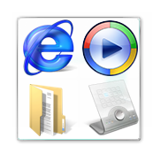|Launcher|Customizable shortcut panel for launching apps or websites|No|No|Yes
||RSS|Displays live RSS or news feed updates|No|Yes|Yes
||RSS in HTML|Displays live RSS or news feed updates|No|Yes|Yes
|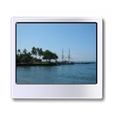|Slideshow|Displays photos from a selected folder as a slideshow|Yes|No|Yes
||WM Player|Controls playback for supported media players|No|No|Yes
|Build 5212|-|-|-|
||Internet Search|Lets you Search from the Gadget|No|No|Yes
||Slideshow|Displays photos from a selected folder as a slideshow|Yes|No|Yes

----

BUGS & TRANSLATIONS
----
If you find any bugs just let me know in a comment or something.
Technically this thing supports multiple languages, you need to edit English.inc and replace it with your values.
I started a few languages already but then I got lazy.

LICENSE
-------
Software and Components

Images and Media 

CREDITS
------
Big thanks to MrLapinou, AtheneRa, poiru, Gavatx and balazslaci (Currency gadget)

Credits to guinness for coming up with the reserve screen space AutoIt Script
